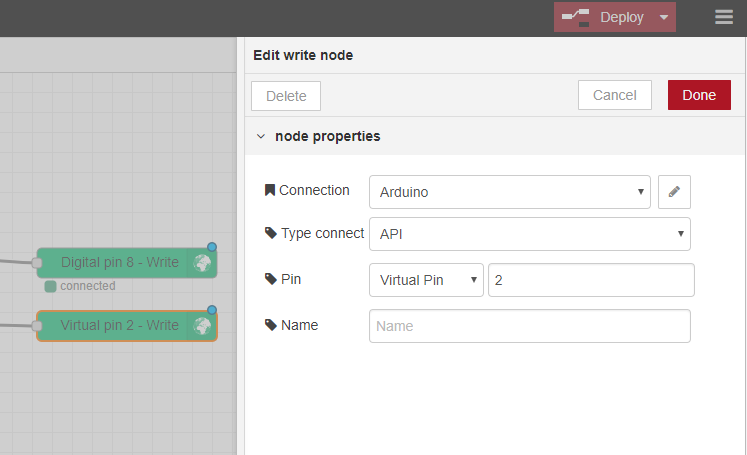

# node-red-contrib-blynk-api
Blynk app integration with Node Red using WebSockets protocol and http protocol (API)

[](https://npmjs.org/package/node-red-contrib-blynk-api)
[](https://badge.fury.io/js/node-red-contrib-blynk-api)

If you installed Node Red globally use this to install
```npm install --global node-red-contrib-blynk-api```




### Supported events and widgets
- read event
- write event
- write command
- emails

### Blynk App Settings
Use Raspberry PI as hardware to access 64 virtual pins or Generic Board for 32.

### How to use

TO ADD

### Debug
TO ADD
Use the verbose `-v` flag when starting Node-Red to get more information

### Available Nodes

TO ADD
